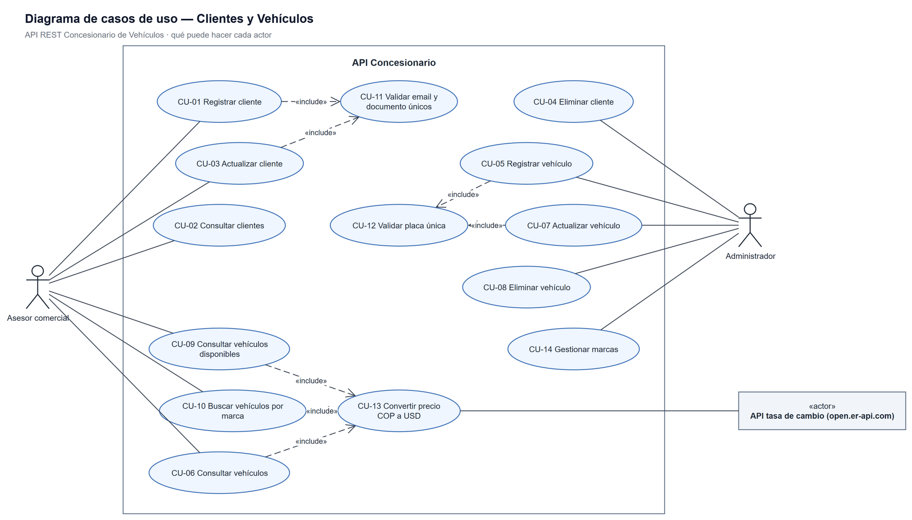
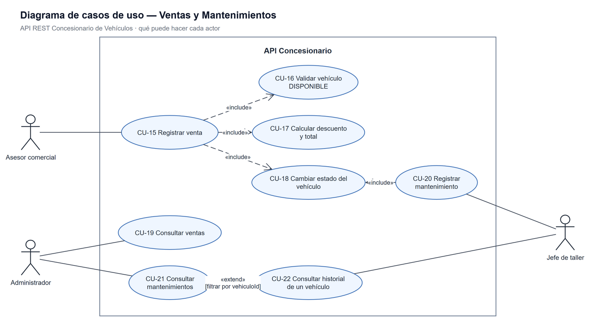
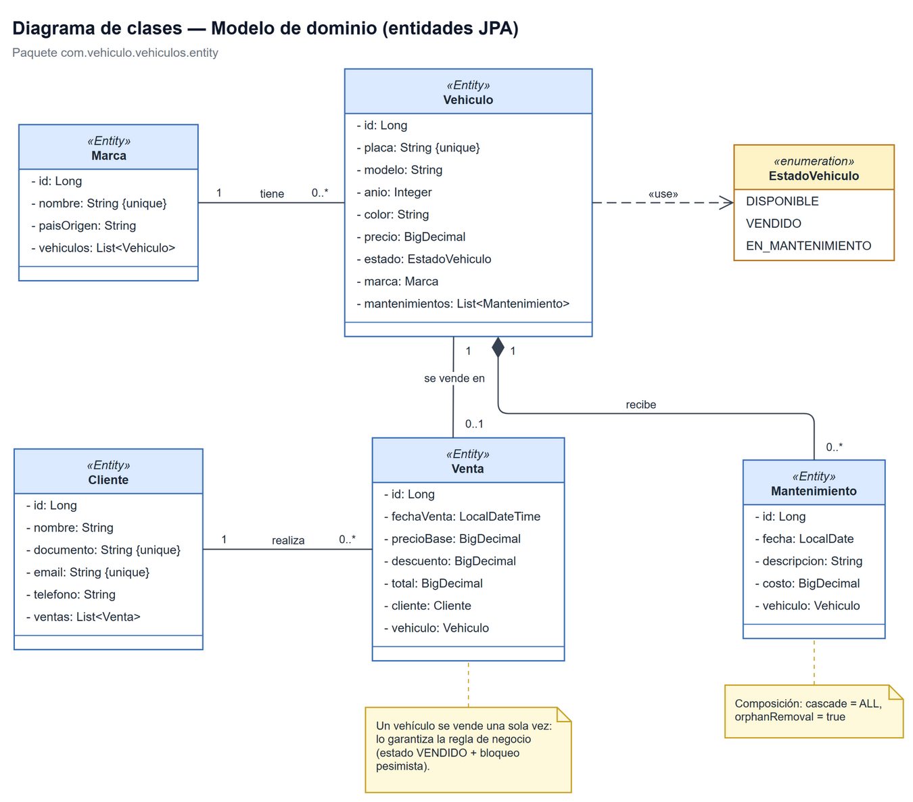
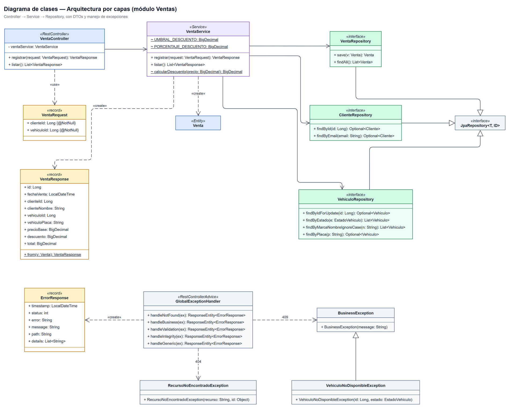
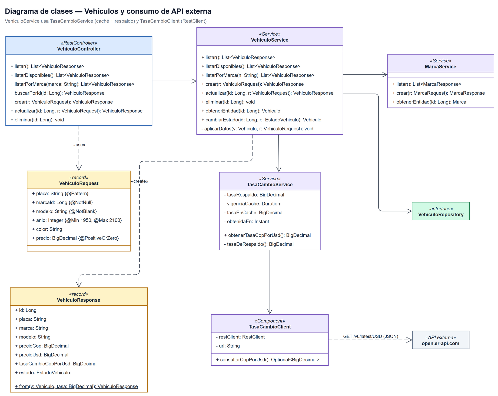
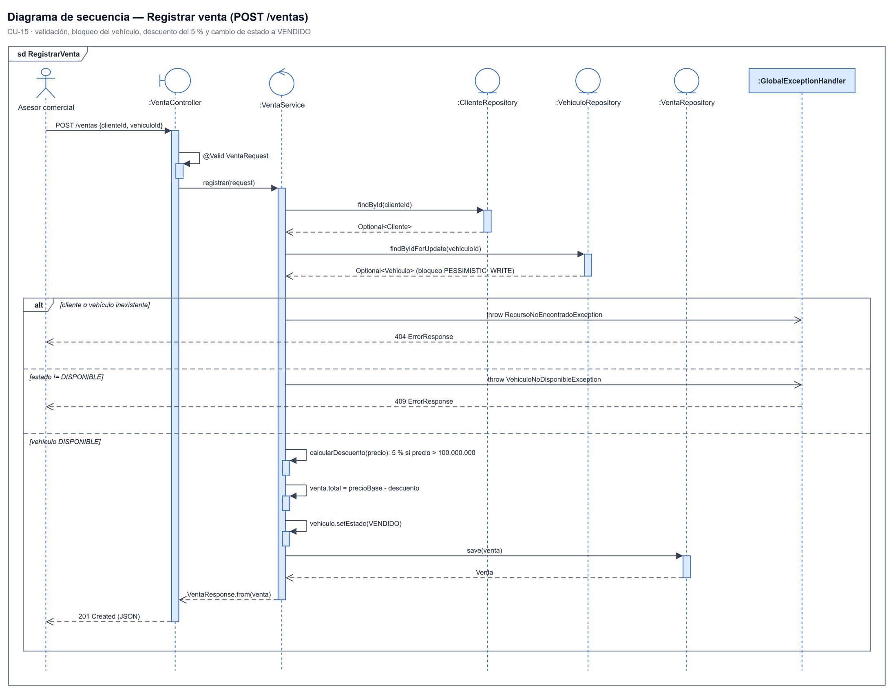
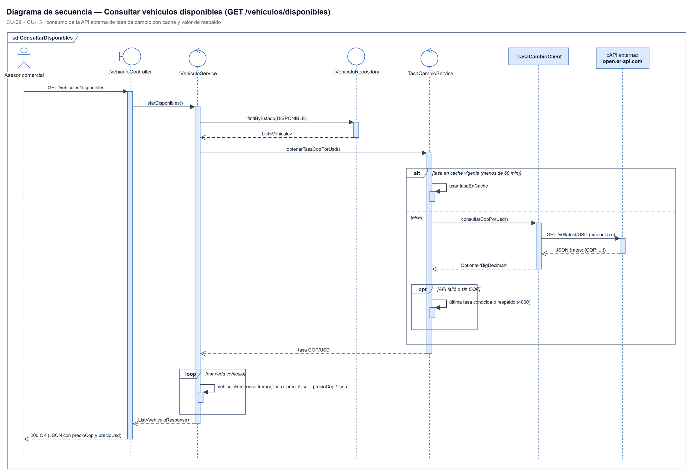
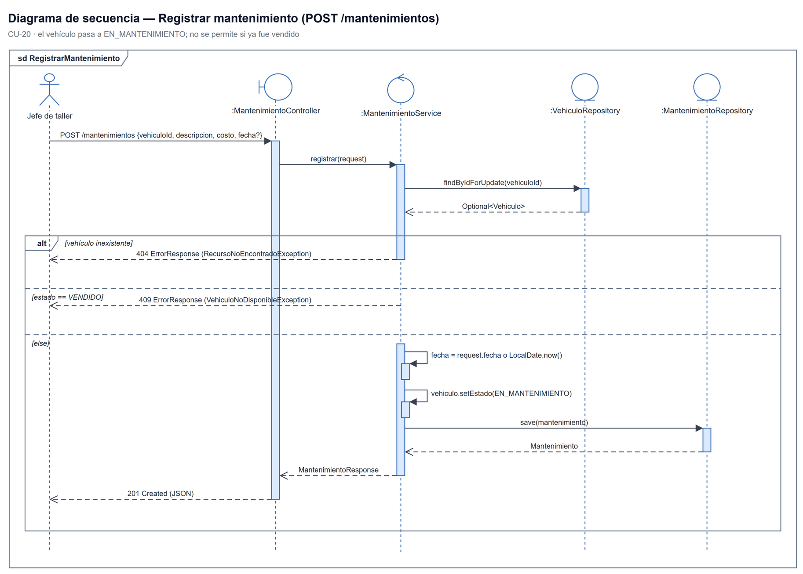
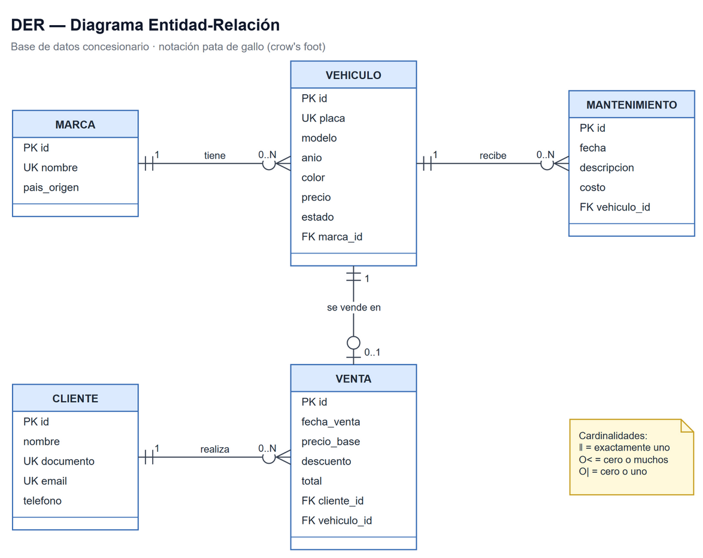
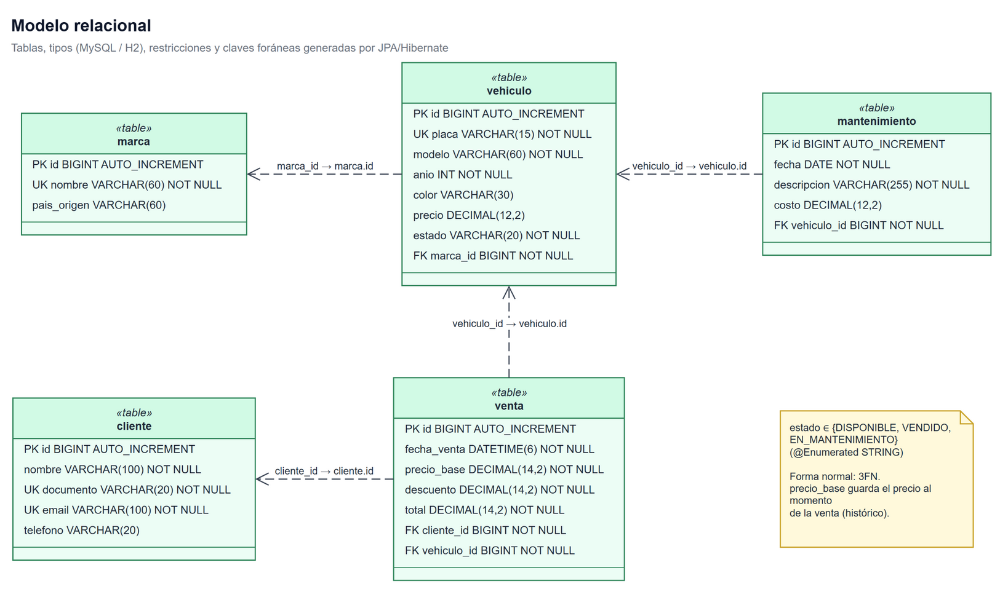

# API REST Concesionario de Vehículos — Documento de entregables

**Autores:** Sharlok Maia Alcazar · Ronny Alejandro Guerrero

Documento de análisis, diseño y verificación del proyecto. Todo lo que aparece aquí está
tomado del código fuente (`src/main/java/com/vehiculo/vehiculos`), no de supuestos.

| Entregable | Archivo |
|---|---|
| Diagramas de casos de uso | [`01-casos-de-uso.drawio`](01-casos-de-uso.drawio) — 2 pestañas |
| Diagramas de clases | [`02-diagrama-de-clases.drawio`](02-diagrama-de-clases.drawio) — 3 pestañas |
| Diagramas de secuencia | [`03-diagramas-de-secuencia.drawio`](03-diagramas-de-secuencia.drawio) — 3 pestañas |
| DER y modelo relacional | [`04-base-de-datos-der-y-modelo-relacional.drawio`](04-base-de-datos-der-y-modelo-relacional.drawio) — 2 pestañas |
| Script del esquema (DDL) | [`../../db/00-esquema.sql`](../../db/00-esquema.sql) |
| Colección Postman final | [`../../postman/Concesionario_Final.postman_collection.json`](../../postman/Concesionario_Final.postman_collection.json) |
| Imágenes de los diagramas | [`png/`](png/) |
| Fuente editable de los diagramas | [`specs/`](specs/) (YAML para regenerarlos) |

Los `.drawio` se abren en [app.diagrams.net](https://app.diagrams.net) o en draw.io desktop.

## Tabla de contenido

1. [Descripción general](#1-descripción-general)
2. [Arquitectura por capas](#2-arquitectura-por-capas)
3. [Requerimientos funcionales](#3-requerimientos-funcionales)
4. [Requerimientos no funcionales](#4-requerimientos-no-funcionales)
5. [Historias de usuario](#5-historias-de-usuario)
6. [Casos de uso](#6-casos-de-uso)
7. [Diagramas de clases y de secuencia](#7-diagramas-de-clases-y-de-secuencia)
8. [Base de datos: DER y modelo relacional](#8-base-de-datos-der-y-modelo-relacional)
9. [Endpoints](#9-endpoints)
10. [Validaciones y manejo de excepciones](#10-validaciones-y-manejo-de-excepciones)
11. [Consumo de API externa](#11-consumo-de-api-externa)
12. [Pruebas](#12-pruebas)
13. [Lista de verificación de requisitos](#13-lista-de-verificación-de-requisitos)

---

## 1. Descripción general

API REST para administrar un concesionario: **clientes, marcas, vehículos, ventas y
mantenimientos**. Aplica reglas de negocio (placa y correo únicos, descuento automático,
estados del vehículo), valida toda entrada, responde errores con un formato JSON único y
consume una API externa de tasa de cambio para mostrar el precio de cada vehículo en COP y USD.

| Tecnología | Uso |
|---|---|
| Java 17 + Spring Boot 4.1 | Web MVC, Data JPA, Validation, RestClient |
| Hibernate / JPA | Persistencia y relaciones entre entidades |
| H2 (archivo) / MySQL (perfil `mysql`) | Base de datos relacional |
| Lombok | Getters/setters de entidades |
| JUnit 5 + Mockito | Pruebas unitarias |
| Postman | Pruebas de los endpoints |
| open.er-api.com | API externa de tasa de cambio USD → COP |

**Actores**

| Actor | Descripción |
|---|---|
| Asesor comercial | Atiende clientes, consulta el inventario y registra ventas. |
| Administrador | Gestiona el inventario (vehículos y marcas), elimina clientes y consulta ventas y mantenimientos. Puede hacer todo lo del asesor. |
| Jefe de taller | Registra mantenimientos y consulta el historial de un vehículo. |
| API de tasa de cambio (sistema externo) | Entrega la tasa COP por USD. |

> La API no tiene autenticación: los actores describen **quién** usa cada función, no un
> control de acceso implementado.

## 2. Arquitectura por capas

```
Cliente HTTP (Postman)
   │  JSON
   ▼
controller/   @RestController — recibe la petición, valida con @Valid, devuelve DTOs
   ▼
service/      @Service — lógica de negocio y transacciones (@Transactional)
   ▼                     └── client/TasaCambioClient — API externa (RestClient)
repository/   Spring Data JPA (JpaRepository)
   ▼
entity/       Entidades JPA  ──►  Base de datos relacional (H2 / MySQL)

dto/          Records de entrada (Request, con validaciones) y salida (Response)
exception/    Excepciones de negocio + GlobalExceptionHandler (@RestControllerAdvice)
```

| Capa | Clases |
|---|---|
| Controladores | `ClienteController`, `MarcaController`, `VehiculoController`, `VentaController`, `MantenimientoController` |
| Servicios | `ClienteService`, `MarcaService`, `VehiculoService`, `VentaService`, `MantenimientoService`, `TasaCambioService` |
| Cliente externo | `TasaCambioClient` |
| Repositorios | `ClienteRepository`, `MarcaRepository`, `VehiculoRepository`, `VentaRepository`, `MantenimientoRepository` |
| Entidades | `Cliente`, `Marca`, `Vehiculo`, `Venta`, `Mantenimiento`, enum `EstadoVehiculo` |
| DTOs | `ClienteRequest/Response`, `MarcaRequest/Response`, `VehiculoRequest/Response`, `VentaRequest/Response`, `MantenimientoRequest/Response`, `ErrorResponse` |
| Excepciones | `RecursoNoEncontradoException`, `BusinessException`, `VehiculoNoDisponibleException`, `GlobalExceptionHandler` |

Las entidades **nunca** salen por la API: los controladores reciben y devuelven DTOs
(`record`), que se construyen con `XxxResponse.from(entidad)`.

## 3. Requerimientos funcionales

| ID | Requerimiento | Endpoint | CU / HU | Prioridad |
|---|---|---|---|---|
| RF-01 | Registrar un cliente con nombre, documento, email y teléfono. | `POST /clientes` | CU-01 / HU-01 | Alta |
| RF-02 | Listar todos los clientes. | `GET /clientes` | CU-02 / HU-02 | Alta |
| RF-03 | Consultar un cliente por id. | `GET /clientes/{id}` | CU-02 / HU-02 | Media |
| RF-04 | Actualizar los datos de un cliente. | `PUT /clientes/{id}` | CU-03 / HU-03 | Alta |
| RF-05 | Eliminar un cliente que no tenga ventas. | `DELETE /clientes/{id}` | CU-04 / HU-04 | Media |
| RF-06 | No permitir dos clientes con el mismo email (sin distinguir mayúsculas) ni el mismo documento. | `POST/PUT /clientes` | CU-11 / HU-01 | Alta |
| RF-07 | Registrar marcas con nombre único y país de origen; listarlas y consultarlas por id. | `POST/GET /marcas`, `GET /marcas/{id}` | CU-14 / HU-05 | Media |
| RF-08 | Registrar un vehículo (placa, marca, modelo, año, color, precio en COP); queda en estado `DISPONIBLE`. | `POST /vehiculos` | CU-05 / HU-06 | Alta |
| RF-09 | Listar todos los vehículos. | `GET /vehiculos` | CU-06 / HU-07 | Alta |
| RF-10 | Consultar un vehículo por id. | `GET /vehiculos/{id}` | CU-06 / HU-07 | Media |
| RF-11 | Listar solo los vehículos `DISPONIBLE`. | `GET /vehiculos/disponibles` | CU-09 / HU-08 | Alta |
| RF-12 | Buscar vehículos por nombre de marca, sin distinguir mayúsculas. | `GET /vehiculos/marca/{marca}` | CU-10 / HU-09 | Alta |
| RF-13 | Actualizar un vehículo sin modificar su estado. | `PUT /vehiculos/{id}` | CU-07 / HU-10 | Alta |
| RF-14 | Eliminar un vehículo que no haya sido vendido. | `DELETE /vehiculos/{id}` | CU-08 / HU-10 | Media |
| RF-15 | La placa es única; se guarda en mayúsculas y sin guion (`abc-123` → `ABC123`). | `POST/PUT /vehiculos` | CU-12 / HU-06 | Alta |
| RF-16 | El precio del vehículo es obligatorio y no puede ser negativo. | `POST/PUT /vehiculos` | CU-05 / HU-06 | Alta |
| RF-17 | Mostrar el precio de cada vehículo en COP y en USD, con la tasa usada, consultando una API externa. | `GET /vehiculos/**` | CU-13 / HU-11 | Alta |
| RF-18 | Registrar una venta asociando un cliente y un vehículo; fecha y total los calcula el sistema. | `POST /ventas` | CU-15 / HU-12 | Alta |
| RF-19 | Aplicar 5 % de descuento si el precio supera estrictamente $100.000.000. | `POST /ventas` | CU-17 / HU-13 | Alta |
| RF-20 | No vender un vehículo `VENDIDO` o `EN_MANTENIMIENTO`, ni uno sin precio. | `POST /ventas` | CU-16 / HU-14 | Alta |
| RF-21 | Al vender, cambiar el estado del vehículo a `VENDIDO`. | `POST /ventas` | CU-18 / HU-12 | Alta |
| RF-22 | Listar las ventas con cliente, placa, precio base, descuento y total. | `GET /ventas` | CU-19 / HU-15 | Alta |
| RF-23 | Registrar un mantenimiento (descripción, costo, fecha opcional → hoy). | `POST /mantenimientos` | CU-20 / HU-16 | Alta |
| RF-24 | Al registrar un mantenimiento, cambiar el vehículo a `EN_MANTENIMIENTO`; no se permite sobre un vehículo vendido. | `POST /mantenimientos` | CU-18 / HU-16 | Alta |
| RF-25 | Listar todos los mantenimientos. | `GET /mantenimientos` | CU-21 / HU-17 | Alta |
| RF-26 | Consultar el historial de mantenimientos de un vehículo. | `GET /mantenimientos/vehiculo/{id}` | CU-22 / HU-17 | Media |
| RF-27 | Validar formato y obligatoriedad de los datos, indicando el error de cada campo. | Todos los `POST/PUT` | HU-18 | Alta |
| RF-28 | Responder todos los errores con el mismo formato JSON y el código HTTP adecuado. | Todos | HU-18 | Alta |

## 4. Requerimientos no funcionales

| ID | Categoría | Requerimiento | Cómo se cumple |
|---|---|---|---|
| RNF-01 | Arquitectura | Separación por capas controller → service → repository. | Paquetes `controller`, `service`, `repository`, `entity`, `dto`, `exception`, `client`. |
| RNF-02 | Mantenibilidad | La API no expone entidades JPA. | Records `*Request` / `*Response` en `dto/`. |
| RNF-03 | Interoperabilidad | Toda entrada y salida es JSON (UTF-8). | `@RestController` + Jackson; fechas ISO-8601. |
| RNF-04 | Tolerancia a fallos | Una caída de la API externa no debe romper la consulta de vehículos. | `TasaCambioService` usa la última tasa conocida o el respaldo (`tasa-cambio.respaldo=4000`); no reintenta durante 1 min tras un fallo. |
| RNF-05 | Rendimiento | Limitar llamadas a la API externa y no bloquear peticiones. | Caché en memoria de 60 min y *timeout* de 5 s (`tasa-cambio.*`). |
| RNF-06 | Integridad de datos | Unicidad y relaciones protegidas también en la base de datos. | `UNIQUE` en placa, email, documento y nombre de marca; `FOREIGN KEY ... NOT NULL`; `DataIntegrityViolationException` → 409. |
| RNF-07 | Concurrencia | Dos ventas simultáneas del mismo vehículo no pueden completarse ambas. | `VehiculoRepository.findByIdForUpdate` con `PESSIMISTIC_WRITE` dentro de `@Transactional`. |
| RNF-08 | Consistencia | Una venta o un mantenimiento y el cambio de estado del vehículo se guardan juntos o no se guardan. | Métodos de servicio `@Transactional`. |
| RNF-09 | Seguridad | Los errores no deben revelar detalles internos; las consultas no deben ser vulnerables a inyección SQL. | El handler genérico responde 500 sin *stack trace*; Spring Data usa consultas parametrizadas. |
| RNF-10 | Exactitud monetaria | Los valores de dinero no deben perder precisión. | `BigDecimal` y `DECIMAL(12,2)` / `DECIMAL(14,2)`, redondeo `HALF_UP`. |
| RNF-11 | Portabilidad | Ejecutable sin instalar base de datos ni permisos de administrador. | H2 en archivo por defecto, Maven Wrapper; MySQL opcional con el perfil `mysql`. |
| RNF-12 | Calidad | La lógica de negocio crítica tiene pruebas automáticas. | `VentaServiceTest`, `MantenimientoServiceTest`, `TasaCambioServiceTest` (JUnit 5 + Mockito). |
| RNF-13 | Usabilidad de la API | Códigos HTTP estándar: 200, 201, 204, 400, 404, 409, 500. | `@ResponseStatus` en controladores y `GlobalExceptionHandler`. |

## 5. Historias de usuario

Formato: *Como … quiero … para …*, con criterios de aceptación **Dado / Cuando / Entonces**.

### Clientes

**HU-01 — Registrar cliente.** Como asesor comercial quiero registrar a un cliente para poder venderle un vehículo.
- Dado nombre, documento (5–15 dígitos) y email válidos, cuando envío `POST /clientes`, entonces recibo 201 con el cliente y su `id`.
- Dado un email ya registrado (aunque cambien mayúsculas) o un documento repetido, entonces recibo 409.
- Dado un email con formato inválido o campos vacíos, entonces recibo 400 con un ítem por campo en `details`.

**HU-02 — Consultar clientes.** Como asesor comercial quiero ver los clientes registrados para encontrar sus datos rápidamente.
- Cuando envío `GET /clientes`, entonces recibo 200 con la lista.
- Cuando consulto `GET /clientes/{id}` con un id inexistente, entonces recibo 404.

**HU-03 — Actualizar cliente.** Como asesor comercial quiero corregir los datos de un cliente para mantener su información al día.
- Dado un cliente existente, cuando envío `PUT /clientes/{id}`, entonces recibo 200 con los datos nuevos.
- Dado un email que pertenece a otro cliente, entonces recibo 409; dado un id inexistente, 404.

**HU-04 — Eliminar cliente.** Como administrador quiero eliminar un cliente para depurar registros que no se usan.
- Dado un cliente sin ventas, cuando envío `DELETE /clientes/{id}`, entonces recibo 204.
- Dado un cliente con ventas, entonces recibo 409 y el cliente se conserva.

### Inventario

**HU-05 — Gestionar marcas.** Como administrador quiero registrar las marcas que vende el concesionario para asociarlas a los vehículos.
- Cuando envío `POST /marcas` con un nombre nuevo, entonces recibo 201; con un nombre repetido (sin distinguir mayúsculas), 409.

**HU-06 — Registrar vehículo.** Como administrador quiero registrar un vehículo para ofrecerlo a la venta.
- Dado placa con formato `ABC123` o `ABC12D`, marca existente, año entre 1950 y 2100 y precio ≥ 0, cuando envío `POST /vehiculos`, entonces recibo 201 y el vehículo queda `DISPONIBLE`.
- Dada una placa repetida, entonces 409; dado un precio negativo o una placa inválida, 400; dada una marca inexistente, 404.

**HU-07 — Consultar vehículos.** Como asesor comercial quiero ver todos los vehículos para conocer el inventario.
- Cuando envío `GET /vehiculos` o `GET /vehiculos/{id}`, entonces recibo 200 con `precioCop`, `precioUsd`, `tasaCambioCopPorUsd` y `estado`.

**HU-08 — Vehículos disponibles.** Como asesor comercial quiero ver solo los vehículos disponibles para no ofrecer uno vendido o en taller.
- Cuando envío `GET /vehiculos/disponibles`, entonces todos los vehículos de la respuesta tienen estado `DISPONIBLE`; si no hay, recibo una lista vacía.

**HU-09 — Buscar por marca.** Como asesor comercial quiero filtrar los vehículos por marca para atender a un cliente que pide una marca concreta.
- Cuando envío `GET /vehiculos/marca/toyota`, entonces recibo los vehículos de la marca «Toyota» (sin distinguir mayúsculas).

**HU-10 — Actualizar y eliminar vehículo.** Como administrador quiero corregir o retirar un vehículo del inventario.
- `PUT /vehiculos/{id}` cambia los datos pero no el estado (200).
- `DELETE /vehiculos/{id}` responde 204; si el vehículo ya fue vendido, 409.

**HU-11 — Precio en dólares.** Como asesor comercial quiero ver el precio en USD para atender a clientes extranjeros.
- Cuando consulto un vehículo, entonces `precioUsd = precioCop / tasa` con 2 decimales.
- Dado que la API externa no responde, entonces la consulta igual responde 200 usando la última tasa o la de respaldo.

### Ventas

**HU-12 — Registrar venta.** Como asesor comercial quiero registrar la venta de un vehículo a un cliente para dejar constancia y evitar ventas duplicadas.
- Dado un cliente existente y un vehículo `DISPONIBLE`, cuando envío `POST /ventas {clienteId, vehiculoId}`, entonces recibo 201 con fecha, precio base, descuento y total calculados por el sistema.
- Y el vehículo queda en estado `VENDIDO`.
- Dado un cliente o vehículo inexistente, 404; dado un body sin ids, 400.

**HU-13 — Descuento automático.** Como administrador quiero que las ventas de más de $100.000.000 tengan 5 % de descuento para aplicar la política comercial sin errores manuales.
- Dado un vehículo de $120.000.000, entonces descuento = $6.000.000 y total = $114.000.000.
- Dado un vehículo de exactamente $100.000.000 o menos, entonces descuento = 0.

**HU-14 — No vender lo que no está disponible.** Como asesor comercial quiero que el sistema rechace la venta de un vehículo vendido o en mantenimiento para no vender algo que no se puede entregar.
- Dado un vehículo `VENDIDO` o `EN_MANTENIMIENTO`, entonces recibo 409 con el estado actual y no se crea la venta.
- Dadas dos ventas simultáneas del mismo vehículo, entonces solo una se completa.

**HU-15 — Consultar ventas.** Como administrador quiero listar las ventas para controlar qué se vendió, a quién y por cuánto.
- Cuando envío `GET /ventas`, entonces recibo cada venta con cliente, placa, fecha, precio base, descuento y total.

### Mantenimientos

**HU-16 — Registrar mantenimiento.** Como jefe de taller quiero registrar un mantenimiento para llevar el historial del vehículo y marcarlo como no disponible.
- Dado un vehículo no vendido, cuando envío `POST /mantenimientos {vehiculoId, descripcion, costo}`, entonces recibo 201 y el vehículo queda `EN_MANTENIMIENTO`.
- Si no envío `fecha`, se usa la fecha actual.
- Dada una descripción vacía o un costo negativo, 400; un vehículo vendido, 409; inexistente, 404.

**HU-17 — Consultar mantenimientos e historial.** Como jefe de taller quiero ver los mantenimientos de un vehículo para conocer su estado y costos.
- `GET /mantenimientos` lista todos; `GET /mantenimientos/vehiculo/{id}` lista los de un vehículo (lista vacía si no tiene; 404 si no existe).

### Transversal

**HU-18 — Errores claros y uniformes.** Como consumidor de la API quiero que todos los errores tengan el mismo formato para manejarlos sin casos especiales.
- Todo error devuelve `{timestamp, status, error, message, path, details[]}`.
- Validación → 400 (un ítem por campo); inexistente → 404; regla de negocio o duplicado → 409; error inesperado → 500 sin detalles internos.

## 6. Casos de uso

Diagramas: [`01-casos-de-uso.drawio`](01-casos-de-uso.drawio)

| Clientes y Vehículos | Ventas y Mantenimientos |
|---|---|
|  |  |

| ID | Caso de uso | Actor | Relación |
|---|---|---|---|
| CU-01 | Registrar cliente | Asesor comercial | «include» CU-11 |
| CU-02 | Consultar clientes | Asesor comercial | — |
| CU-03 | Actualizar cliente | Asesor comercial | «include» CU-11 |
| CU-04 | Eliminar cliente | Administrador | — |
| CU-05 | Registrar vehículo | Administrador | «include» CU-12 |
| CU-06 | Consultar vehículos | Asesor comercial | «include» CU-13 |
| CU-07 | Actualizar vehículo | Administrador | «include» CU-12 |
| CU-08 | Eliminar vehículo | Administrador | — |
| CU-09 | Consultar vehículos disponibles | Asesor comercial | «include» CU-13 |
| CU-10 | Buscar vehículos por marca | Asesor comercial | «include» CU-13 |
| CU-11 | Validar email y documento únicos | (incluido) | — |
| CU-12 | Validar placa única | (incluido) | — |
| CU-13 | Convertir precio COP a USD | API de tasa de cambio | — |
| CU-14 | Gestionar marcas | Administrador | — |
| CU-15 | Registrar venta | Asesor comercial | «include» CU-16, CU-17, CU-18 |
| CU-16 | Validar vehículo DISPONIBLE | (incluido) | — |
| CU-17 | Calcular descuento y total | (incluido) | — |
| CU-18 | Cambiar estado del vehículo | (incluido) | — |
| CU-19 | Consultar ventas | Administrador | — |
| CU-20 | Registrar mantenimiento | Jefe de taller | «include» CU-18 |
| CU-21 | Consultar mantenimientos | Administrador | — |
| CU-22 | Consultar historial de un vehículo | Jefe de taller | «extend» CU-21 |

### Especificación de los casos de uso principales

**CU-15 Registrar venta**

| | |
|---|---|
| Actor | Asesor comercial |
| Precondición | El cliente y el vehículo existen; el vehículo está `DISPONIBLE` y tiene precio. |
| Flujo principal | 1. El actor envía `POST /ventas {clienteId, vehiculoId}`. 2. El sistema valida el body. 3. Busca el cliente. 4. Busca y bloquea el vehículo (`findByIdForUpdate`). 5. Verifica que esté `DISPONIBLE` (CU-16). 6. Calcula descuento y total (CU-17). 7. Cambia el vehículo a `VENDIDO` (CU-18). 8. Guarda la venta y responde 201. |
| Flujos alternos | A1. Body sin ids → 400. A2. Cliente o vehículo inexistente → 404. A3. Vehículo `VENDIDO` o `EN_MANTENIMIENTO` → 409. A4. Vehículo sin precio → 409. |
| Postcondición | Venta guardada con `precio_base`, `descuento` y `total`; vehículo en `VENDIDO`. |

**CU-20 Registrar mantenimiento**

| | |
|---|---|
| Actor | Jefe de taller |
| Precondición | El vehículo existe y no está vendido. |
| Flujo principal | 1. `POST /mantenimientos {vehiculoId, descripcion, costo, fecha?}`. 2. Valida el body. 3. Busca y bloquea el vehículo. 4. Si no hay fecha, usa la actual. 5. Cambia el vehículo a `EN_MANTENIMIENTO`. 6. Guarda y responde 201. |
| Flujos alternos | A1. Descripción vacía o costo negativo → 400. A2. Vehículo inexistente → 404. A3. Vehículo `VENDIDO` → 409. |
| Postcondición | Mantenimiento guardado; vehículo en `EN_MANTENIMIENTO`. |

**CU-05 Registrar vehículo**

| | |
|---|---|
| Actor | Administrador |
| Precondición | La marca existe; la placa no está registrada. |
| Flujo principal | 1. `POST /vehiculos`. 2. Valida formato de placa, año y precio ≥ 0. 3. Normaliza la placa (mayúsculas, sin guion) y verifica que sea única (CU-12). 4. Asocia la marca. 5. Guarda con estado `DISPONIBLE`. 6. Responde 201 con el precio en COP y USD (CU-13). |
| Flujos alternos | A1. Datos inválidos → 400. A2. Marca inexistente → 404. A3. Placa repetida → 409. |
| Postcondición | Vehículo guardado en `DISPONIBLE`. |

**CU-01 Registrar cliente**

| | |
|---|---|
| Actor | Asesor comercial |
| Precondición | El email y el documento no están registrados. |
| Flujo principal | 1. `POST /clientes`. 2. Valida nombre, documento (5–15 dígitos), email y teléfono. 3. Normaliza el email a minúsculas y verifica email y documento únicos (CU-11). 4. Guarda y responde 201. |
| Flujos alternos | A1. Datos inválidos → 400. A2. Email o documento repetido → 409. |
| Postcondición | Cliente guardado. |

**CU-13 Convertir precio COP a USD**

| | |
|---|---|
| Actor | API de tasa de cambio (sistema externo) |
| Disparador | Incluido en CU-05, CU-06, CU-07, CU-09 y CU-10 (toda respuesta de vehículo). |
| Flujo principal | 1. Si hay una tasa en caché de menos de 60 min, la usa. 2. Si no, consulta `GET https://open.er-api.com/v6/latest/USD` (timeout 5 s). 3. Toma `rates.COP` y la guarda en caché. 4. Calcula `precioUsd = precioCop / tasa` con 2 decimales. |
| Flujos alternos | A1. La API falla, tarda o no trae COP → usa la última tasa conocida o la de respaldo (4000) y no reintenta durante 1 minuto. |

## 7. Diagramas de clases y de secuencia

Diagramas de clases: [`02-diagrama-de-clases.drawio`](02-diagrama-de-clases.drawio)

**Modelo de dominio (entidades JPA)**



**Arquitectura por capas — módulo Ventas** (controller, service, repositories, DTOs, excepciones)



**Vehículos y consumo de API externa**



Diagramas de secuencia: [`03-diagramas-de-secuencia.drawio`](03-diagramas-de-secuencia.drawio)

**Registrar venta (`POST /ventas`)**



**Consultar vehículos disponibles con la API externa (`GET /vehiculos/disponibles`)**



**Registrar mantenimiento (`POST /mantenimientos`)**



## 8. Base de datos: DER y modelo relacional

Diagramas: [`04-base-de-datos-der-y-modelo-relacional.drawio`](04-base-de-datos-der-y-modelo-relacional.drawio) ·
Script: [`db/00-esquema.sql`](../../db/00-esquema.sql)

### DER



| Relación | Cardinalidad | Clave foránea | Mapeo JPA |
|---|---|---|---|
| MARCA tiene VEHICULO | 1 : N | `vehiculo.marca_id` | `@ManyToOne(optional=false)` / `@OneToMany(mappedBy="marca")` |
| CLIENTE realiza VENTA | 1 : N | `venta.cliente_id` | `@ManyToOne(optional=false)` / `@OneToMany(mappedBy="cliente")` |
| VEHICULO se vende en VENTA | 1 : 0..1 | `venta.vehiculo_id` | `@ManyToOne(optional=false)`; el «una sola vez» lo garantiza la regla de estado `VENDIDO` |
| VEHICULO recibe MANTENIMIENTO | 1 : N | `mantenimiento.vehiculo_id` | `@ManyToOne` / `@OneToMany(cascade=ALL, orphanRemoval=true)` |

### Modelo relacional



```
marca         (id PK, nombre UNIQUE NOT NULL, pais_origen)
cliente       (id PK, nombre NOT NULL, documento UNIQUE NOT NULL, email UNIQUE NOT NULL, telefono)
vehiculo      (id PK, placa UNIQUE NOT NULL, modelo NOT NULL, anio NOT NULL, color, precio,
               estado NOT NULL, marca_id FK → marca(id) NOT NULL)
venta         (id PK, fecha_venta NOT NULL, precio_base NOT NULL, descuento NOT NULL, total NOT NULL,
               cliente_id FK → cliente(id) NOT NULL, vehiculo_id FK → vehiculo(id) NOT NULL)
mantenimiento (id PK, fecha NOT NULL, descripcion NOT NULL, costo,
               vehiculo_id FK → vehiculo(id) NOT NULL)
```

- El esquema está en **3FN**: cada atributo depende solo de la clave de su tabla; la marca
  es una tabla aparte en lugar de un texto repetido en cada vehículo.
- `venta.precio_base` guarda el precio al momento de la venta (dato histórico), así que un
  cambio posterior del precio del vehículo no altera las ventas ya registradas.
- Las tablas las crea Hibernate (`spring.jpa.hibernate.ddl-auto=update`). El archivo
  `db/00-esquema.sql` es el DDL equivalente para MySQL, útil para revisarlo o crear el esquema a mano.

## 9. Endpoints

Base: `http://localhost:8080`. Todas las peticiones y respuestas son JSON.

### Endpoints mínimos exigidos

| Módulo | Método | Ruta | Respuestas | Estado |
|---|---|---|---|---|
| Clientes | GET | `/clientes` | 200 | ✅ |
| Clientes | POST | `/clientes` | 201 · 400 · 409 | ✅ |
| Clientes | PUT | `/clientes/{id}` | 200 · 400 · 404 · 409 | ✅ |
| Clientes | DELETE | `/clientes/{id}` | 204 · 404 · 409 | ✅ |
| Vehículos | GET | `/vehiculos` | 200 | ✅ |
| Vehículos | POST | `/vehiculos` | 201 · 400 · 404 · 409 | ✅ |
| Vehículos | GET | `/vehiculos/disponibles` | 200 | ✅ |
| Vehículos | GET | `/vehiculos/marca/{marca}` | 200 | ✅ |
| Ventas | POST | `/ventas` | 201 · 400 · 404 · 409 | ✅ |
| Ventas | GET | `/ventas` | 200 | ✅ |
| Mantenimientos | POST | `/mantenimientos` | 201 · 400 · 404 · 409 | ✅ |
| Mantenimientos | GET | `/mantenimientos` | 200 | ✅ |

### Endpoints adicionales

| Método | Ruta | Descripción |
|---|---|---|
| GET | `/clientes/{id}` | Cliente por id (200 · 404) |
| GET | `/vehiculos/{id}` | Vehículo por id (200 · 404) |
| PUT | `/vehiculos/{id}` | Actualizar vehículo (200 · 400 · 404 · 409) |
| DELETE | `/vehiculos/{id}` | Eliminar vehículo (204 · 404 · 409 si fue vendido) |
| GET | `/marcas` | Listar marcas |
| GET | `/marcas/{id}` | Marca por id (200 · 404) |
| POST | `/marcas` | Crear marca (201 · 400 · 409) |
| GET | `/mantenimientos/vehiculo/{vehiculoId}` | Historial de un vehículo (200 · 404) |

### Ejemplos de JSON

`POST /clientes`

```json
{ "nombre": "Carlos Pérez", "documento": "1047456789", "email": "carlos@correo.com", "telefono": "3001234567" }
```

`POST /vehiculos` (el estado no se envía: siempre queda `DISPONIBLE`)

```json
{ "placa": "ABC123", "marcaId": 1, "modelo": "Corolla", "anio": 2024, "color": "Blanco", "precio": 95000000 }
```

Respuesta de vehículo (con conversión de la API externa):

```json
{
  "id": 1, "placa": "ABC123", "marcaId": 1, "marca": "Toyota", "modelo": "Corolla",
  "anio": 2024, "color": "Blanco", "precioCop": 95000000, "precioUsd": 24281.46,
  "tasaCambioCopPorUsd": 3912.45, "estado": "DISPONIBLE"
}
```

`POST /ventas` → respuesta 201:

```json
// petición
{ "clienteId": 1, "vehiculoId": 2 }
// respuesta
{
  "id": 1, "fechaVenta": "2026-10-08T10:15:30.123456", "clienteId": 1, "clienteNombre": "Carlos Pérez",
  "vehiculoId": 2, "vehiculoPlaca": "XYZ789", "precioBase": 120000000.00,
  "descuento": 6000000.00, "total": 114000000.00
}
```

`POST /mantenimientos`

```json
{ "vehiculoId": 6, "descripcion": "Cambio de aceite", "costo": 150000, "fecha": "2026-10-08" }
```

## 10. Validaciones y manejo de excepciones

### Validaciones (Bean Validation en los DTOs + reglas en los servicios)

| DTO / servicio | Campo | Regla |
|---|---|---|
| `ClienteRequest` | nombre | `@NotBlank`, máx. 100 |
| | documento | `@NotBlank`, `@Pattern ^[0-9]{5,15}$` |
| | email | `@NotBlank`, `@Email`, máx. 100 |
| | telefono | opcional, `@Pattern ^[0-9+ ]{7,20}$` |
| `MarcaRequest` | nombre | `@NotBlank`, máx. 60 |
| `VehiculoRequest` | placa | `@NotBlank`, `@Pattern ^[A-Za-z]{3}-?[0-9]{2}[A-Za-z0-9]$` |
| | marcaId | `@NotNull` |
| | modelo | `@NotBlank`, máx. 60 |
| | anio | `@NotNull`, `@Min(1950)`, `@Max(2100)` |
| | precio | `@NotNull`, `@PositiveOrZero`, `@Digits(10,2)` |
| `VentaRequest` | clienteId, vehiculoId | `@NotNull` |
| `MantenimientoRequest` | vehiculoId | `@NotNull` |
| | descripcion | `@NotBlank`, máx. 255 |
| | costo | `@PositiveOrZero` |
| `ClienteService` | email / documento | únicos (email sin distinguir mayúsculas) → 409 |
| `ClienteService` | eliminar | no si tiene ventas → 409 |
| `MarcaService` | nombre | único sin distinguir mayúsculas → 409 |
| `VehiculoService` | placa | única, normalizada → 409 |
| `VehiculoService` | eliminar | no si está `VENDIDO` → 409 |
| `VentaService` | vehículo | debe estar `DISPONIBLE` y tener precio → 409 |
| `MantenimientoService` | vehículo | no puede estar `VENDIDO` → 409 |

### Excepciones

| Excepción | HTTP | Cuándo |
|---|---|---|
| `MethodArgumentNotValidException` | 400 | Falla una validación del DTO (`details` trae un ítem por campo) |
| `HttpMessageNotReadableException`, `MethodArgumentTypeMismatchException` | 400 | JSON mal formado o id no numérico |
| `RecursoNoEncontradoException` | 404 | El id no existe |
| `BusinessException` | 409 | Se viola una regla de negocio |
| `VehiculoNoDisponibleException` (hereda de `BusinessException`) | 409 | Vender / dar mantenimiento a un vehículo no disponible |
| `DataIntegrityViolationException` | 409 | Restricción `UNIQUE` o FK en la base de datos |
| `Exception` | 500 | Error inesperado (sin detalles internos) |

Formato único (`ErrorResponse`):

```json
{
  "timestamp": "2026-10-08T10:15:00.123",
  "status": 400,
  "error": "Bad Request",
  "message": "Error de validación",
  "path": "/vehiculos",
  "details": ["precio: el precio no puede ser negativo"]
}
```

## 11. Consumo de API externa

| | |
|---|---|
| API | `GET https://open.er-api.com/v6/latest/USD` (gratuita, sin API key) |
| Cliente | `client/TasaCambioClient` con `RestClient` de Spring, timeout de conexión y lectura de 5 s |
| JSON leído | `record RespuestaApi(String result, Map<String, BigDecimal> rates)` → se usa `rates.COP` |
| Lógica | `service/TasaCambioService`: caché de 60 min; si la API falla usa la última tasa o el respaldo (4000) y espera 1 min antes de reintentar |
| Uso | `VehiculoResponse.from(vehiculo, tasa)` calcula `precioUsd = precioCop / tasa` (2 decimales, `HALF_UP`) |
| Configuración | `tasa-cambio.url`, `tasa-cambio.respaldo`, `tasa-cambio.minutos-cache`, `tasa-cambio.timeout-segundos` en `application.properties` |

## 12. Pruebas

### Pruebas unitarias (JUnit 5 + Mockito)

```bash
mvnw.cmd test
```

| Clase | Qué prueba |
|---|---|
| `VentaServiceTest` (4) | Descuento del 5 % sobre el umbral, sin descuento en el umbral exacto, rechazo de vehículos `VENDIDO`/`EN_MANTENIMIENTO`, cliente inexistente → 404 |
| `MantenimientoServiceTest` (4) | Registro y cambio a `EN_MANTENIMIENTO` (costo con 2 decimales), costo opcional, rechazo de vehículo vendido, historial de vehículo inexistente → 404 |
| `TasaCambioServiceTest` (4) | Caché vigente, valor de respaldo si la API nunca responde, última tasa conocida si falla, no reintenta justo después de un fallo |
| `VehiculosApplicationTests` (1) | El contexto de Spring arranca |

Resultado verificado: **13 pruebas, 0 fallos, 0 errores**.

### Pruebas en Postman

| Colección | Contenido |
|---|---|
| `postman/Concesionario_Final.postman_collection.json` | **Colección final de entrega**: 44 peticiones, todos los módulos, con pruebas automáticas. Crea sus propios datos, así que se puede ejecutar varias veces seguidas sobre una base vacía o con datos. |
| `postman/Concesionario_PersonaA.postman_collection.json` | Clientes, marcas y vehículos (Persona A). |
| `postman/AutoDrive-Motors-B.postman_collection.json` | Ventas y mantenimientos (Persona B); requiere `db/02-datos-prueba.sql`. |

Cómo ejecutar la colección final:

1. Arrancar la API: `mvnw.cmd spring-boot:run`.
2. En Postman: *Import* → `postman/Concesionario_Final.postman_collection.json`.
3. Clic derecho en la colección → **Run collection** → *Run*. Cada petición comprueba el
   código HTTP, el formato `ErrorResponse` en los errores y las reglas de negocio
   (descuento, total, estados, `precioUsd`).

## 13. Lista de verificación de requisitos

### Solución funcional

| # | Requisito | Evidencia |
|---|---|---|
| 1 | API REST funcionando | 5 controladores `@RestController`; colección Postman final ejecutada sin fallos |
| 2 | Base de datos relacional conectada | H2 en archivo (`application.properties`) y MySQL (`application-mysql.properties`); DDL en `db/00-esquema.sql` |
| 3 | Relaciones entre entidades | `@ManyToOne` / `@OneToMany` en `Vehiculo`, `Venta`, `Mantenimiento`, `Cliente`, `Marca` (ver §8) |
| 4 | CRUD completos | Clientes y Vehículos: crear, listar, consultar por id, actualizar y eliminar. Marcas, Ventas y Mantenimientos: crear y consultar (lo que pide el enunciado) |
| 5 | Validaciones implementadas | Bean Validation en los DTOs + reglas de negocio en los servicios (§10) |
| 6 | Consumo de API externa | `TasaCambioClient` + `TasaCambioService` (§11) |
| 7 | Pruebas en Postman | `postman/Concesionario_Final.postman_collection.json` (§12) |
| 8 | Arquitectura organizada por capas | `controller` → `service` → `repository` → `entity`, más `dto`, `exception`, `client` (§2) |
| 9 | Manejo de excepciones | `GlobalExceptionHandler` + 3 excepciones propias (§10) |
| 10 | DTOs | 11 records en `dto/` |
| 11 | Documentación UML y DER | Casos de uso, clases, secuencia, DER y modelo relacional (§6–§8) |

### Nivel intermedio esperado

| Aspecto | Dónde se evidencia |
|---|---|
| Uso correcto de relaciones JPA | `FetchType.LAZY`, `optional=false`, `mappedBy`, `cascade=ALL` + `orphanRemoval` en mantenimientos, `@Enumerated(STRING)` |
| Lógica de negocio | Descuento del 5 %, estados del vehículo, unicidad, no eliminar con dependencias, bloqueo pesimista en ventas |
| Consumo de APIs externas | `RestClient` con timeout, caché y respaldo |
| Separación de responsabilidades | Controladores sin lógica; servicios sin detalles HTTP; el cliente externo solo hace la llamada y el servicio decide caché/respaldo |
| Buenas prácticas de backend | Inyección por constructor, `@Transactional(readOnly = true)` en lecturas, `open-in-view=false`, `BigDecimal` para dinero, entidades no expuestas |
| Manejo de JSON | Records como DTOs, fechas ISO-8601, lectura del JSON de la API externa a un `record` |
| Validaciones robustas | Doble capa (DTO + servicio + restricciones de BD), mensajes por campo en `details` |
