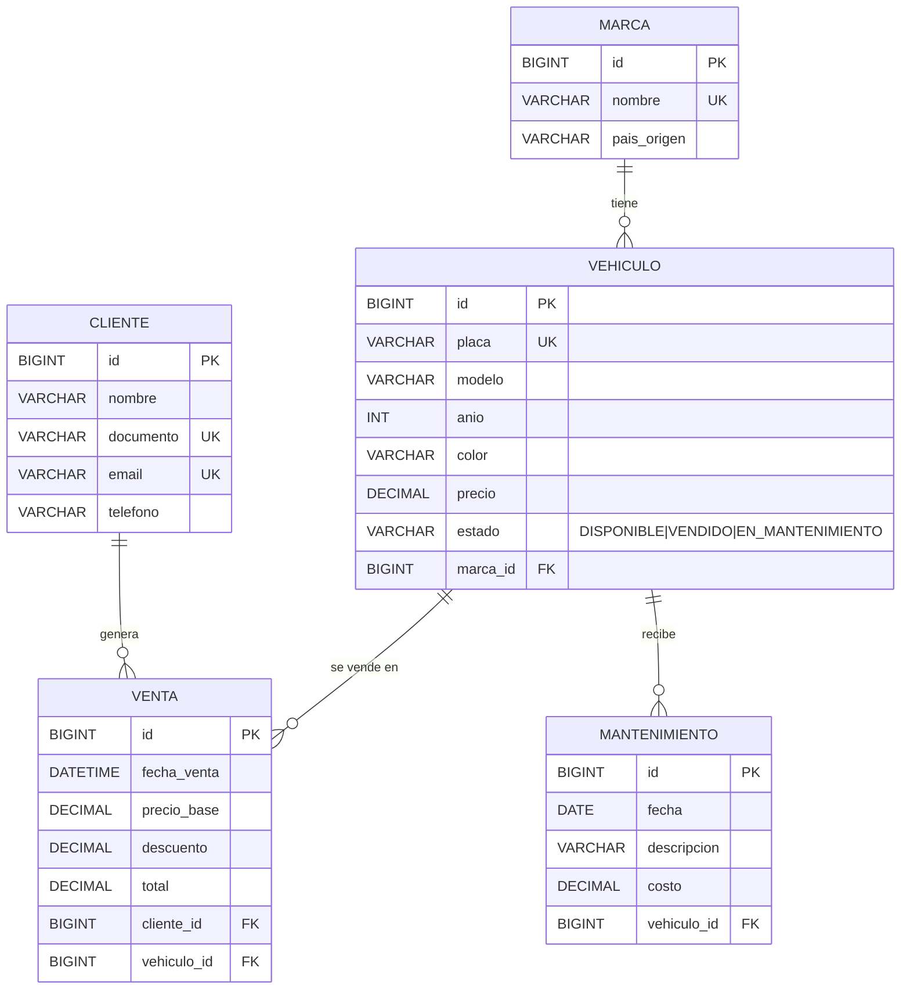

# Modelo de datos

Derivado directamente de las entidades JPA (`com.vehiculo.vehiculos.entity`).
Base de datos: MySQL, esquema `autodrive_motors` (`db/01-crear-bd.sql`).

## DER



## Modelo relacional

```
marca(id PK, nombre UNIQUE NOT NULL, pais_origen)
cliente(id PK, nombre NOT NULL, documento UNIQUE NOT NULL, email UNIQUE NOT NULL, telefono)
vehiculo(id PK, placa UNIQUE NOT NULL, modelo NOT NULL, anio NOT NULL, color, precio,
         estado NOT NULL, marca_id FK -> marca NOT NULL)
venta(id PK, fecha_venta NOT NULL, precio_base NOT NULL, descuento NOT NULL, total NOT NULL,
      cliente_id FK -> cliente NOT NULL, vehiculo_id FK -> vehiculo NOT NULL)
mantenimiento(id PK, fecha NOT NULL, descripcion NOT NULL, costo,
              vehiculo_id FK -> vehiculo NOT NULL)
```

## Relaciones

| Relación | Cardinalidad | Lado dueño (FK) | Notas |
|---|---|---|---|
| Marca → Vehiculo | 1 : N | `vehiculo.marca_id` | obligatoria |
| Cliente → Venta | 1 : N | `venta.cliente_id` | obligatoria |
| Vehiculo → Venta | 1 : N | `venta.vehiculo_id` | un vehículo se vende una vez: lo garantiza la regla de negocio (estado `VENDIDO`) |
| Vehiculo → Mantenimiento | 1 : N | `mantenimiento.vehiculo_id` | `cascade ALL` + `orphanRemoval` |

`venta.precio_base` guarda el precio al momento de la venta, para que un
cambio posterior del precio del vehículo no altere el histórico.

## Formato de error JSON

```json
{
  "timestamp": "2026-10-05T23:15:00.123",
  "status": 400,
  "error": "Bad Request",
  "message": "Error de validación",
  "path": "/api/vehiculos",
  "details": ["placa: no debe estar vacío"]
}
```

`details` es `[]` salvo en errores de validación.
Mapeo: `RecursoNoEncontradoException` → 404, `BusinessException` y
`VehiculoNoDisponibleException` → 409, validación / JSON inválido → 400,
`DataIntegrityViolationException` → 409, resto → 500.
