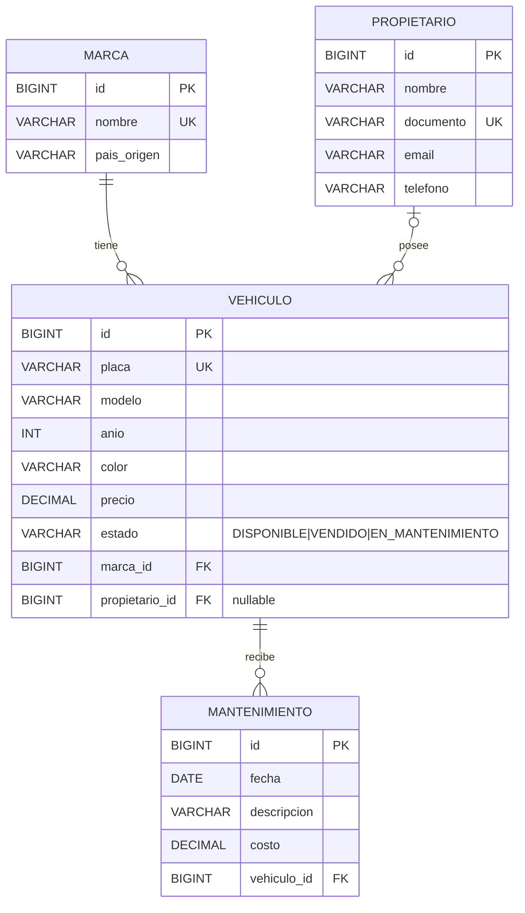

# Modelo de datos

Derivado directamente de las entidades JPA (`com.vehiculo.vehiculos.entity`).

## DER



## Modelo relacional

```
marca(id PK, nombre UNIQUE NOT NULL, pais_origen)
propietario(id PK, nombre NOT NULL, documento UNIQUE NOT NULL, email, telefono)
vehiculo(id PK, placa UNIQUE NOT NULL, modelo NOT NULL, anio NOT NULL, color, precio,
         estado NOT NULL, marca_id FK -> marca NOT NULL, propietario_id FK -> propietario NULL)
mantenimiento(id PK, fecha NOT NULL, descripcion NOT NULL, costo,
              vehiculo_id FK -> vehiculo NOT NULL)
```

## Relaciones

| Relación | Cardinalidad | Lado dueño (FK) | Notas |
|---|---|---|---|
| Marca → Vehiculo | 1 : N | `vehiculo.marca_id` | obligatoria |
| Propietario → Vehiculo | 1 : N | `vehiculo.propietario_id` | opcional (inventario sin dueño) |
| Vehiculo → Mantenimiento | 1 : N | `mantenimiento.vehiculo_id` | `cascade ALL` + `orphanRemoval` |

## Formato de error JSON

```json
{
  "timestamp": "2026-10-05T23:15:00.123",
  "status": 400,
  "error": "Bad Request",
  "message": "Error de validación",
  "path": "/api/vehiculos",
  "details": ["placa: no debe estar vacío"]
}
```

`details` es `[]` salvo en errores de validación.
Mapeo: `ResourceNotFoundException` → 404, `BusinessException` → 409,
validación / JSON inválido → 400, `DataIntegrityViolationException` → 409, resto → 500.
